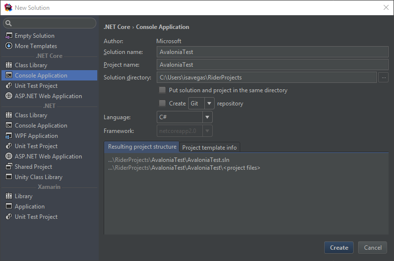
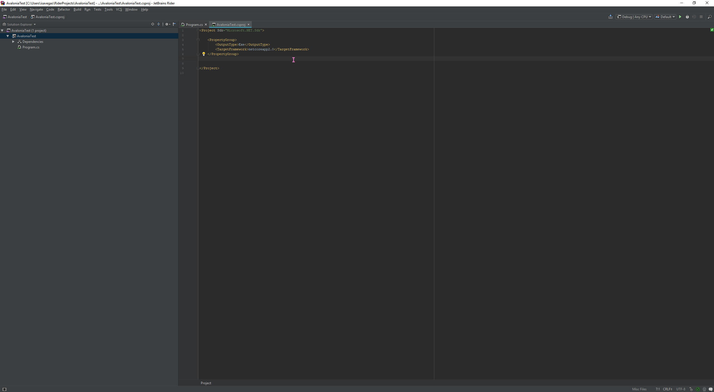
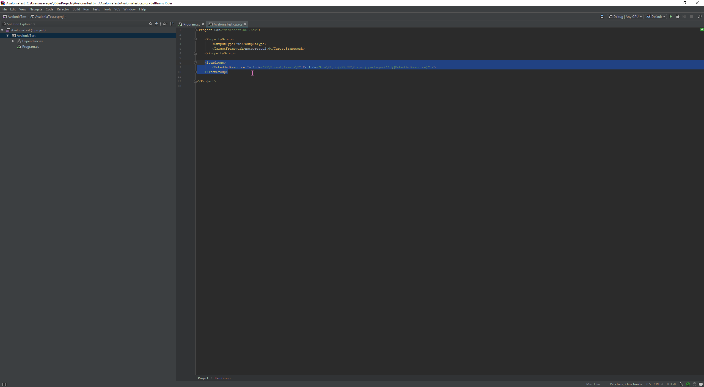
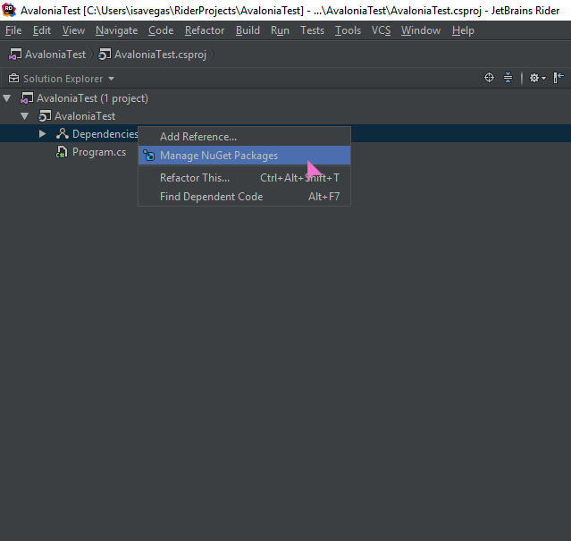
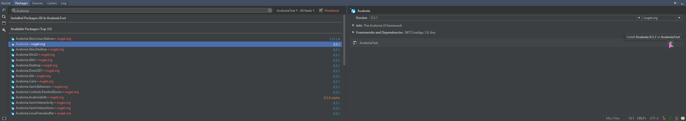
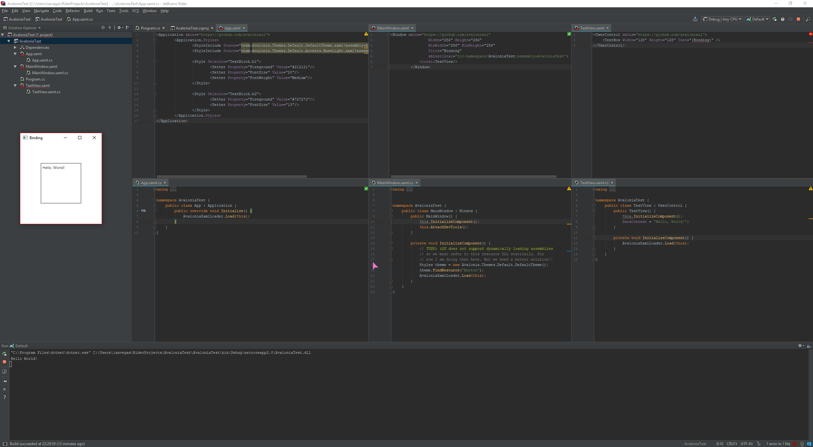

# Getting Started with Rider

### Note that we don't currently have an extension for Jetbrains Rider, so you will need to initialize and scaffold our project by hand.

1) Create a DotNET Core console application in Rider.  
    

2) Click on your project in the left sidebar and press your F4 key.  
    

3) Paste the following code into your `<Project>` tag.  
    ```xml
    <ItemGroup>
        <EmbeddedResource Include="**\*.xaml;Assets\*" Exclude="bin\**;obj\**;**\*.xproj;packages\**;@(EmbeddedResource)" />
    </ItemGroup>
    ```
    

4) Right click `Dependencies` in the sidebar and click `Manage Nuget Packages`.  
    

5) Install the `Avalonia` and `Avalonia.Desktop` packages by selecting each and clicking the green `+` for your project on the right.  
    

6) Initialize your application in `Program.cs`.  
    ```CSharp
    using System;
    using Avalonia;

    namespace AvaloniaTest {
        class Program {
            static void Main(string[] args) {
                Console.WriteLine("Hello World!");
                AppBuilder.Configure<App>()
                    .UsePlatformDetect()
                    .Start<MainWindow>();
            }
        }
    }
    ```

7) Set up your XAML  
    ---
    App.xaml
    ```XML
    <Application xmlns="https://github.com/avaloniaui">
        <Application.Styles>
                <StyleInclude Source="resm:Avalonia.Themes.Default.DefaultTheme.xaml?assembly=Avalonia.Themes.Default"/>
                <StyleInclude Source="resm:Avalonia.Themes.Default.Accents.BaseLight.xaml?assembly=Avalonia.Themes.Default"/>

                <Style Selector="TextBlock.h1">
                        <Setter Property="Foreground" Value="#212121"/>
                        <Setter Property="FontSize" Value="20"/>
                        <Setter Property="FontWeight" Value="Medium"/>
                </Style>

                <Style Selector="TextBlock.h2">
                        <Setter Property="Foreground" Value="#727272"/>
                        <Setter Property="FontSize" Value="13"/>
                </Style>
        </Application.Styles>
    </Application>
    ```
    ---
    MainWindow.xaml
    ```XML
    <Window xmlns="https://github.com/avaloniaui"
        Width="256" Height="256"
        MinWidth="256" MinHeight="256"
        Title="Binding"
        xmlns:local="clr-namespace:AvaloniaTest;assembly=AvaloniaTest">
        <local:TestView/>
    </Window>
    ```
    ---
    TestView.xaml
    ```XML
    <UserControl xmlns="https://github.com/avaloniaui">
        <TextBox Width="128" Height="128" Text="{Binding}" />
    </UserControl>
    ```

8) Set up your code-behind classes as follows  
    ---
    App.xaml.cs
    ```CSharp
    using Avalonia;
    using Avalonia.Markup.Xaml;

    namespace AvaloniaTest {
        public class App : Application {
            public override void Initialize() {
                AvaloniaXamlLoader.Load(this);
            }
        }
    }
    ```
    ---
    MainWindow.xaml.cs
    ```CSharp
    using Avalonia;
    using Avalonia.Controls;
    using Avalonia.Markup.Xaml;
    using Avalonia.Styling;

    namespace AvaloniaTest {
        public class MainWindow : Window {
            public MainWindow() {
                this.InitializeComponent();
                this.AttachDevTools();
            }

            private void InitializeComponent() {
                // TODO: iOS does not support dynamically loading assemblies
                // so we must refer to this resource DLL statically. For
                // now I am doing that here. But we need a better solution!!
                Styles theme = new Avalonia.Themes.Default.DefaultTheme();
                theme.FindResource("Button");
                AvaloniaXamlLoader.Load(this);
            }
        }
    }
    ```
    ---
    TestView.xaml.cs
    ```CSharp
    using Avalonia.Controls;
    using Avalonia.Markup.Xaml;

    namespace AvaloniaTest {
        public class TestView : UserControl {
            public TestView() {
                this.InitializeComponent();
                DataContext = "Hello, World!";
            }
        
            private void InitializeComponent() {
                AvaloniaXamlLoader.Load(this);
            }
        }
    }
    ```

9) You should now be able to build and run your application.  
    

## Next steps

Keep in mind that you will have to manually create and populate `.xaml` and `.xaml.cs` files.

Take a look at our [Binding](./binding) and [Controls](./controls) tutorials to learn how to build out your application.
